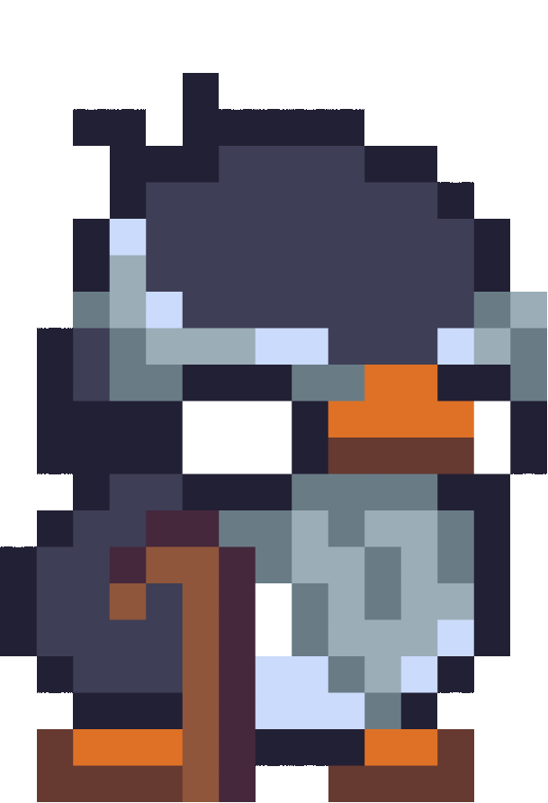
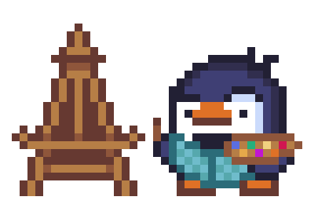

<!--
**LeoLChalot/LeoLChalot** is a ✨ _special_ ✨ repository because its `README.md` (this file) appears on your GitHub profile.

Here are some ideas to get you started: -->

🔭 I am currently working at SafeBear

🌱 I’m currently learning SvelteJs and Data Analyze

💬 Ask me about something fun.

📫 How to contact me: Did you say "contact" ? 

😄 Pronouns: Béluga

---

 🛠️ Languages and Toooooooools 

  &nbsp;
  &nbsp;
  &nbsp;
  &nbsp;
  &nbsp;
  &nbsp;
  &nbsp;
  &nbsp;
  

  

  

